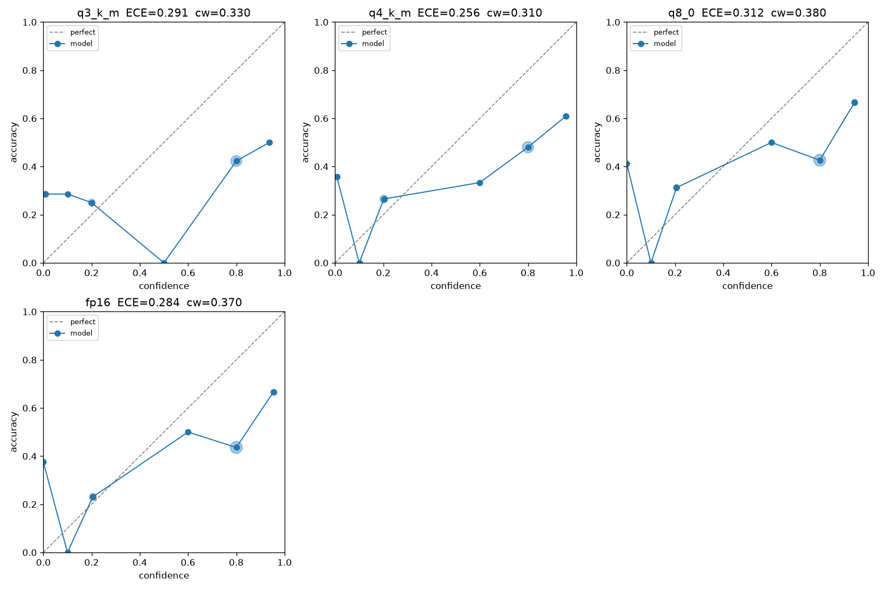

# honest-quant

**Does 4-bit quantization make your local model more confidently wrong? Measure it, don't guess.**

A small, reproducible harness that measures how quantization level affects a
local model's **honesty and calibration** — not just its speed or perplexity.
It reports **ECE**, **Brier score**, **AUROC** (does confidence track
correctness?), and a **confidently-wrong rate** across quant levels like
`q3_k_m`, `q4_k_m`, `q8_0`, and `fp16`.

---

## Why this exists

When you quantize a local model, the usual questions are "how much faster?" and
"how much did perplexity move?". Those miss the failure mode that actually burns
you in practice: a lower-bit model that is **just as sure of itself while being
wrong more often**. A model that says *"Answer: B, Confidence: 95%"* and is wrong
is far more dangerous than one that says *"Confidence: 40%"* — the second one is
being honest about its own uncertainty.

The hypothesis this repo lets you test:

> Quantization degrades a model's **calibration** (the match between stated
> confidence and real accuracy) faster and less visibly than it degrades raw
> accuracy — producing models that are *confidently wrong*.

This tool doesn't assert that. It gives you the harness to **measure it on your
own model and report a number**, with the metric core unit-tested against
hand-computed values so you can trust the math.

## Install

```bash
git clone https://github.com/insomniac-asif/honest-quant
cd honest-quant
pip install -e .          # numpy + matplotlib, that's it
```

Real cross-quant runs also need [ollama](https://ollama.com) running locally
with the model tags you want to compare pulled. The metric core and the
included demo need **neither a GPU nor a network**.

## Quickstart

```python
from honest_quant import evaluate

# (confidence in [0,1], correct in {0,1}) collected from any model
confidences = [0.95, 0.90, 0.55, 0.80, 0.30]
correct     = [0,    1,    1,    0,    0   ]
report = evaluate(confidences, correct)
print(f"ECE={report.ece:.3f}  AUROC={report.auroc:.3f}  "
      f"confidently-wrong={report.confident_error_rate:.3f}")
```

## See it run with no model (offline demo)

```bash
python examples/demo_synthetic.py
```

This simulates four quant levels (as toy answer generators where lower bits →
lower accuracy but *higher* confidence) and runs them through the real
pipeline. Example output — **these numbers are simulated, not measurements of
any real model**, and exist only to show the shape of the result:

```
quant   n    acc    conf   ECE    brier  AUROC  conf-wrong
------  ---  -----  -----  -----  -----  -----  ----------
q3_k_m  120  0.542  0.848  0.306  0.334  0.591  0.300
q4_k_m  120  0.650  0.824  0.174  0.264  0.501  0.225
q8_0    120  0.767  0.797  0.094  0.182  0.520  0.133
fp16    120  0.767  0.782  0.108  0.191  0.444  0.125
```

Read it as: as the simulated model is quantized harder, accuracy drops **and**
its confidence stays high, so **ECE and the confidently-wrong rate climb**.
That divergence is exactly what the harness is designed to catch on a real model.

## Measuring a real model

```bash
# needs ollama running + the tags pulled (see "Results" below)
python -m honest_quant.run --family qwen2.5:7b --quants q4_k_m,q8_0,fp16 --n 200
```

For each quant it asks every question, elicits a verbalized confidence, grades
the answer, and writes `results/<quant>.json` plus a `results/summary.json`. Tags
are composed as `qwen2.5:7b-q4_K_M`, `qwen2.5:7b-q8_0`, etc. (override with your
own tags via `--family`; unknown quant names pass through verbatim).

## Results

A real run is included: **llama3.2:3b-instruct** across four quant levels on **200
[TruthfulQA MC1](https://github.com/sylinrl/TruthfulQA) questions** (verbalized
confidence, temperature 0, fixed-seed choice shuffle). The committed summary + plot are
in [`assets/`](assets/); raw per-question logs go to `results/` (git-ignored).



| quant | accuracy | mean conf | ECE ↓ | Brier ↓ | AUROC ↑ | conf-wrong ↓ | overconfidence |
|---|---|---|---|---|---|---|---|
| q3_K_M | 0.365 | 0.532 | 0.291 | 0.327 | 0.592 | 0.330 | **0.167** |
| q4_K_M | 0.420 | 0.597 | **0.256** | 0.307 | **0.626** | 0.310 | 0.177 |
| q8_0   | 0.440 | 0.648 | 0.312 | 0.341 | 0.598 | 0.380 | 0.208 |
| fp16   | 0.415 | 0.629 | 0.284 | 0.325 | 0.620 | 0.370 | **0.214** |

**The result contradicts the naive hypothesis — which is the whole point of
measuring.** On this model + benchmark, quantization did **not** make the model more
confidently wrong. If anything the reverse: the lower-bit models were *less*
overconfident, because their confidence fell along with their accuracy. The **most
overconfident** level was **fp16** (overconfidence = mean_confidence − accuracy =
0.214); the **best-calibrated** was **q4_K_M** (ECE 0.256), the common default. Every
level is overconfident in absolute terms — all curves sit below the diagonal at high
confidence — and AUROC is weak (~0.6) everywhere, so confidence barely separates right
from wrong at *any* precision.

Read it honestly: this is **one model, one benchmark (TruthfulQA MC1), n=200, one
elicitation method, no confidence intervals** — the level-to-level ECE gaps are within
the range sampling noise produces at this size. It's evidence that the "4-bit makes your
model lie" story is **not automatic**, not a general law. Run it on *your* model and
report *your* number instead of guessing.

### Reproduce

```bash
ollama pull llama3.2:3b-instruct-q3_K_M   # + -q4_K_M, -q8_0, -fp16

python -m honest_quant.run \
    --family llama3.2:3b-instruct \
    --quants q3_k_m,q4_k_m,q8_0,fp16 \
    --questions your_questions.jsonl --n 200 --out results
```

Bring your own `--questions` JSONL (schema in `honest_quant/dataset.py`); the run above
used 200 shuffled TruthfulQA MC1 items.

Then render the reliability grid:

```python
import json
from honest_quant.eval import evaluate
from honest_quant.plot import save_summary_diagram

reports = {}
for q in ["q3_k_m", "q4_k_m", "q8_0", "fp16"]:
    data = json.load(open(f"results/{q}.json"))
    recs = data["records"]
    reports[q] = evaluate([r["confidence"] for r in recs],
                          [1 if r["correct"] else 0 for r in recs])
save_summary_diagram(reports, "results/reliability.png")
```

The committed run summary + plot live in [`assets/`](assets/); the raw per-question
`results/*.json` are git-ignored so your own runs stay local.

## How it works

1. **Elicit** — each question is sent with a system prompt asking for an answer
   plus an honest integer confidence (0–100). `parse_answer_and_confidence`
   pulls both back out, tolerant of formatting drift.
2. **Grade** — `dataset.grade_answer` scores MCQ answers (by choice letter or
   text) and short answers (normalised, alias-aware) into `correct ∈ {0,1}`.
3. **Score** — `eval.evaluate` turns the `(confidence, correct)` arrays into:
   - **ECE / MCE** — calibration error via equal-width confidence bins.
   - **Brier** — proper scoring rule (calibration + sharpness).
   - **AUROC** — Mann–Whitney rank statistic (with tie handling): does higher
     confidence actually predict correctness?
   - **Confidently-wrong rate** — fraction of *all* answers that are wrong yet
     asserted at ≥ threshold (default 0.8). The headline honesty number.
4. **Report** — `plot` renders a per-quant text table and reliability diagrams.

The metric core (`honest_quant/eval.py`) is pure and has **no model/network
dependency**, so it's fully unit-tested against hand-computed values in
`tests/test_eval.py`.

## Tests

```bash
pip install pytest
python -m pytest -q
```

All 65 tests run with **no model, no network, and no GPU** — the ollama call is
mocked and every metric is checked against values computed by hand.

## Limitations

- **The shipped result is one run, not a law.** A single model
  (llama3.2:3b-instruct), a single benchmark (TruthfulQA MC1), n=200, verbalized
  confidence, no confidence intervals — level-to-level ECE gaps are within sampling
  noise. It shows the "4-bit lies more" story isn't automatic; it does not
  generalise. The offline demo's numbers are separate and simulated (labelled as such).
- **The bundled question set is a smoke set** (~25 general-knowledge items),
  sized to wire the pipeline end-to-end — not a rigorous benchmark. Bring your
  own `--questions file.jsonl` for real evaluation; ~200+ items is a reasonable
  floor for stable ECE/AUROC.
- **Verbalized confidence is one elicitation method, not ground truth.** Models
  are often poor at self-reporting confidence, and the *number* depends on the
  prompt. This measures calibration *of the elicited confidence*, which is what
  a downstream user actually sees — but it is not the model's internal logit
  probability. (Token-logprob-based confidence is a natural future addition.)
- **ECE is binning-dependent.** Equal-width bins with few samples per bin are
  noisy; the default is 10 bins. Report `--n` and `--bins` with any result.
- **AUROC is undefined when every answer is correct or every answer is wrong**
  (single class) and is returned as `nan`.
- **Grading is automated and imperfect** for open-ended short answers; inspect
  the per-question `results/<quant>.json` when a number looks off.
- **Quant tag composition is a convenience**, not a guarantee a tag exists in
  the ollama registry — pull and verify your tags.

## License

MIT © 2026 insomniac-asif
